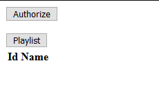
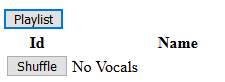
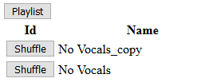

# PlaylistRandomizer

Spotify playlist song shuffler. Copies a playlist appends `_copy` to the name and randomizes the song order in the list.

There is at least one other way to reorder lists without having to copy into another. This method has the fewest API calls.

Spotify does not have a `DELETE` playlist on their public API. Go into the spotify desktop app and right click on playlist to "delete". The playlist is only soft deleted. It is still accessible for other user accounts.

## Setup

1. Download .Net Core SDK <https://dotnet.microsoft.com/download>
1. Setup an app <https://developer.spotify.com/dashboard/login>
1. Add a `.\appsettings.json` with:

``` C#
{
    "SpotifyAuthorizeConfig": {
        "ClientID": [your spotify registered application id],
        "ClientSecret": [your spotify secret],
        "HmacSecret": [Any random string]
    }
}
```

## Run

1. `dotnet run --project .\PlaylistRandomizer\PlaylistRandomizer.csproj`
1. The first time create self signed cert `dotnet dev-certs https`
1. <https://localhost:5001>

    
1. Click Authorize. Might silently authorize if you are logged into the spotify web app in the same browser. See console output for details.
1. Click playlist to load

    
1. Shuffle a playlist. Mash the buttons once! If you don't know what's going on watch the console. When a successful shuffle occurs a copy will be added to the list.

    
1. Since the spotify API does not provide a delete you will need to go into the web/desktop app and manage playlists. Delete the original and rename the copy.
